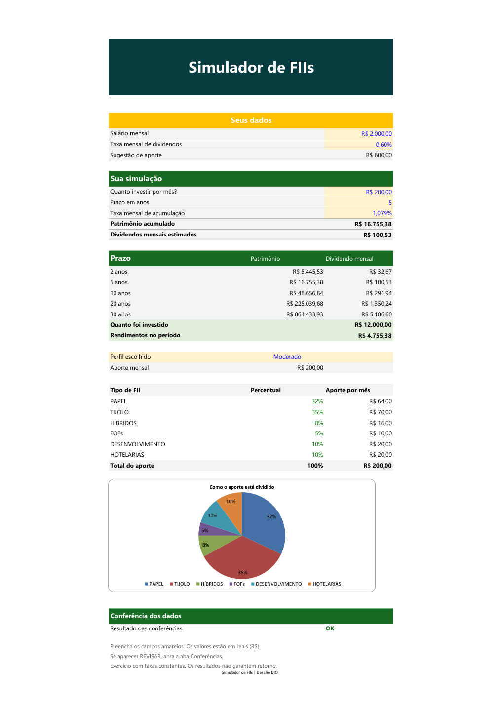

# Simulador de investimentos em FIIs

Projeto do desafio de Excel da DIO para simular aportes mensais, patrimônio acumulado e dividendos estimados. Inclui três perfis de distribuição e cenários de 2, 5, 10, 20 e 30 anos.

**[Baixar a planilha](planilha/Controle_Investimentos_FII.xlsx)**

## Como usar

1. Baixe o arquivo pelo botão **Download raw file** e abra no Excel.
2. Em **Simulador**, altere as células amarelas: salário, aporte, prazo, taxas mensais e perfil.
3. Em **Ajustes**, informe o capital inicial e escolha aportes no início ou no fim do mês.
4. Confira os resultados. Se aparecer **REVISAR**, consulte a aba **Conferências**.

A taxa de acumulação calcula o patrimônio. A taxa de dividendos estima a renda mensal sobre o valor final. Trocar o perfil altera apenas a distribuição do aporte; os percentuais podem ser editados em **Perfis** e devem somar 100%.

As taxas são hipotéticas. A simulação não considera inflação, impostos, custos ou variação das cotas e não representa recomendação de investimento.
